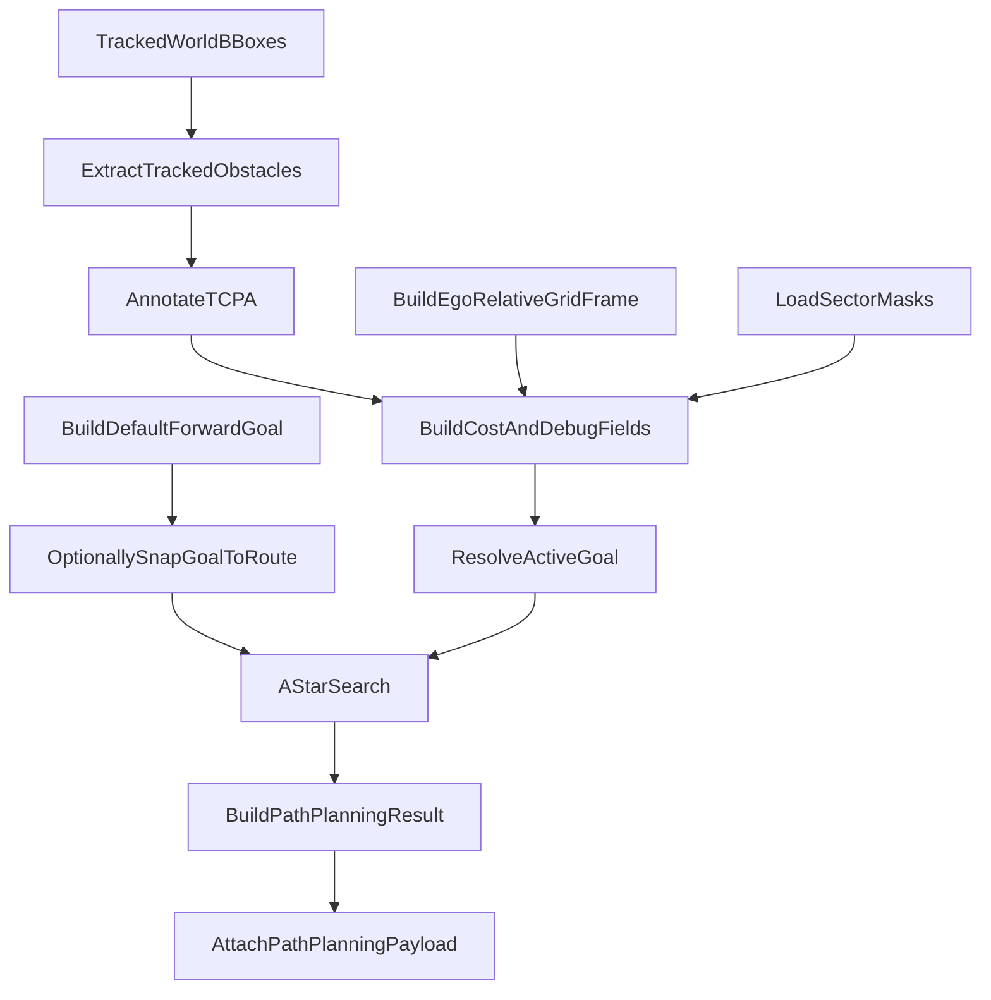
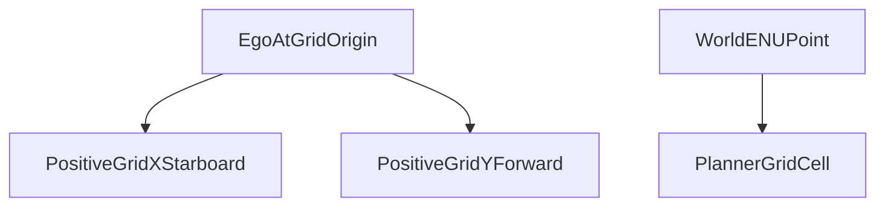
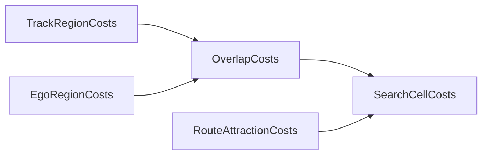
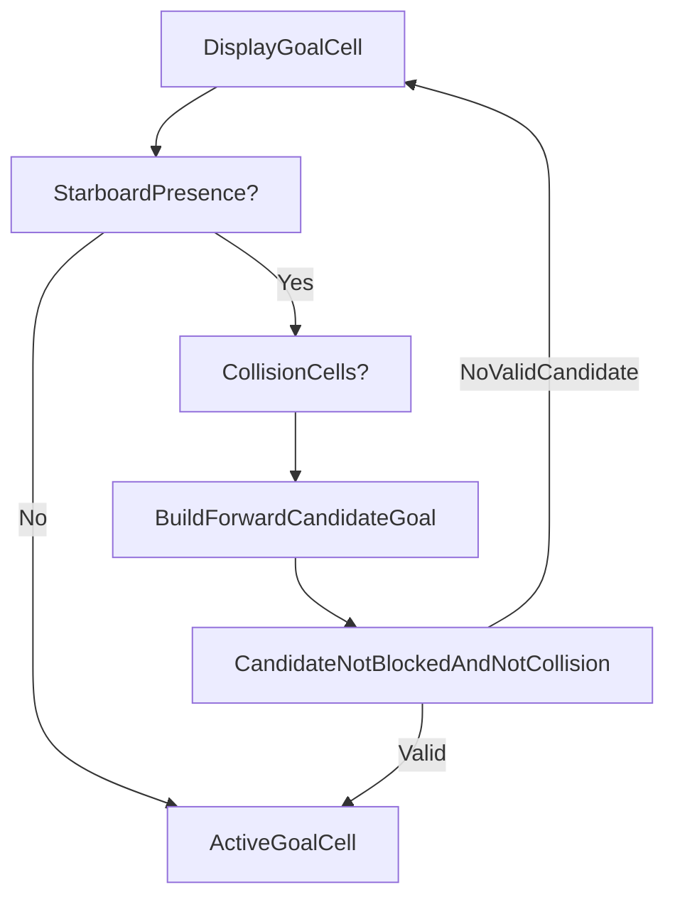

# A* Ego-Relative Path Planner Guide

This guide explains the end-to-end workflow of the A* ego-relative path planner in this repository.

It is intentionally specific to the `mode = "astar_ego_relative"` path implemented in `sort_ws/path_planner.py` and wired into the runtime from `sort_ws/bridge.py`.

This guide does not try to fully document `astar_enu`, `theta_enu`, or `theta_ego_relative`. Those modes share code with this planner, but this document stays focused on the current A* ego-relative workflow.

## See Also

- `README.md` for broader repo runtime context
- `docs/WORLD_SPACE_CONSTANT_VELOCITY_TRACKER_GUIDE.md` for how the world-space tracker produces `tracked_world`
- `sort_ws/path_planner.py` for the source of truth on planner behavior and payload fields

## What This Planner Actually Does

At a high level, each planner cycle does this:

1. Receive `tracked_world` objects from the world-space tracker.
2. Convert those tracked objects into planner obstacles with ENU position and velocity.
3. Compute a default goal straight ahead of ego.
4. Optionally snap that goal to a route point.
5. Build an ego-relative grid aligned with ego forward and starboard.
6. Build cost layers from obstacle positions, projected motion, route attraction, ego obstacle rules, and COLREG logic.
7. Optionally move the active goal when COLREG starboard-side logic requires it.
8. Run A* on the grid.
9. Package the path, cells, and debug layers into `path_planning` output.

The key design choice is that the planner searches in a grid attached to the ego vessel, not a fixed global grid.

## Planner Pipeline

## Core Files And Responsibilities

### `sort_ws/path_planner.py`

This file contains almost the entire planner implementation. The main pieces are:

- `PathPlanningParams`
- `TrackedObstacle`
- `GridFrame`
- `AStarGridResult`
- `PathPlanningResult`
- `_extract_obstacles()`
- `_annotate_obstacles_tcpa()`
- `_resolve_route_goal_enu()`
- `_build_grid_frame()`
- `_build_cost_field()`
- `_resolve_colreg_active_goal_cell()`
- `astar_path()`
- `PathPlannerRuntime.compute()`

### `sort_ws/bridge.py`

The bridge does not implement planning logic, but it is the runtime entrypoint. `_process_video_payload()`:

- calls `path_planner.compute(...)`
- passes in ego ENU, ego heading, ego velocity, and `tracked_world`
- serializes the result with `result.to_payload(...)`
- writes the payload to `vm.metadata["path_planning"]`

The downstream control socket also exposes:

- `get_path_planning_params`
- `set_path_planning_params`
- `set_path_planning_route`

## Step 1: Planner Inputs Enter From The Bridge

The planner runs after world-space tracking. In `bridge.py`, `_process_video_payload()` calls `path_planner.compute(...)` only when the bridge has:

- `ego.heading_deg`
- `ego.enu_from_ref`
- `ego.ref_latlon`

So the planner depends on the same usable ego/world reference information as the world-space tracker.

The inputs passed into `compute()` are:

- `frame_number`
- `ego_enu`
- `ego_ref_latlon`
- `ego_heading_deg`
- `ego_vel_east_mps`
- `ego_vel_north_mps`
- `tracked_world`

## Step 2: Convert `tracked_world` Into Obstacles

The first planner-specific transformation is `_extract_obstacles(tracked_world)`.

For each record in `tracked_world`, the planner tries to extract:

- `world_east_m`
- `world_north_m`
- `vel_east_mps`
- `vel_north_mps`
- `speed_mps`
- `track_id`

If the position fields are missing or invalid, the record is skipped.

Each surviving record becomes a `TrackedObstacle` with:

- `position_enu`
- velocity
- speed
- `track_id`
- a pointer to the original source record in `source_record`

## Step 3: Compute TCPA For Each Obstacle

After obstacles are extracted, `PathPlannerRuntime.compute()` calls `_annotate_obstacles_tcpa(...)`.

That function:

- computes time to closest point of approach with `_compute_tcpa_s()`
- stores the result on the obstacle
- writes `tcpa_s` and `tcpa_is_infinite` back into the original tracked record

TCPA is the planner's motion horizon:

- if TCPA is valid and positive, the planner projects both obstacle and ego forward to that horizon
- if TCPA is invalid or not closing, the planner falls back to static cost regions

## Step 4: Choose The Goal

Goal selection happens in `PathPlannerRuntime.compute()`.

### Default display goal

The planner first creates a straight-ahead goal using:

- `params.path_distance_m`
- `ego_heading_deg`

It does this with `right_fwd_to_enu_m(right_m=0.0, forward_m=path_distance_m, ...)`.

This becomes the initial `display_goal_enu`.

### Optional route goal

If route support is enabled, the planner may replace that default goal with a nearby route point.

Route handling works like this:

1. `set_route_points(...)` stores route points on the runtime.
2. `_parse_route_latlon_points()` accepts either `{lat, lon}` objects or `[lon, lat]` pairs.
3. `_route_latlon_points_to_enu()` converts those route points into ENU using `ego_ref_latlon`.
4. `_resolve_route_goal_enu()` picks the nearest route point within `route_goal_radius_m` of the default forward goal.

If `use_route_goal` is off, or no route point is within range, the planner keeps the default straight-ahead goal.

## Step 5: Build The Ego-Relative Grid Frame

The grid frame is created by `_build_grid_frame(...)`.

For `mode = "astar_ego_relative"`, it returns a `GridFrame` with:

- `space = "ego_relative"`
- `origin_enu = ego_enu`
- `heading_deg = ego_heading_deg`
- `grid_size_m = params.grid_size_m`

The basis vectors are built from ego heading:

- `starboard_unit_enu`
- `forward_unit_enu`

In this mode:

- positive grid `x` means starboard
- positive grid `y` means forward

`GridFrame` then handles:

- `enu_to_grid()`
- `grid_to_enu()`
- `offset_to_enu()`

## Ego-Relative Grid Concept

## Step 6: Build Search Bounds And Masks

Inside `astar_path()`:

- `start = frame.enu_to_grid(start_enu)`
- `display_goal = frame.enu_to_grid(display_goal_enu)`

Then `_search_bounds()` creates bounded search limits from:

- the start cell
- the display goal cell
- padding derived from `path_distance_m` and `grid_size_m`

Before cost construction, the runtime loads or builds two cached local sector masks:

- the ego obstacle sector
- the COLREG danger sector

Those masks are cached by:

- `grid_size_m`
- radius
- angle range

Then `astar_path()` projects them into the current search space with `_project_local_sector_cells()`.

In ego-relative mode, projection is simple:

- local offsets are added directly to the ego cell

## Step 7: Build Track Regions, Ego Regions, And Overlap Costs

Obstacle-related search costs are built in `_build_cost_field(...)`.

For each obstacle, `_build_track_regions_and_overlap(...)` creates:

- a track region
- an ego region
- an overlap region

If TCPA is valid:

- `track_region` becomes a motion ramp from current obstacle position to projected future position
- `ego_region` becomes a motion ramp from current ego position to projected future position

If TCPA is not valid:

- both regions are static expansions around current positions

The actual search cost is based on overlap, not simple union:

- `overlap = track_region * ego_region`

That concentrates cost where the planner predicts ego and obstacle futures intersect.

## Cost Field Composition

## Step 8: Apply COLREG Logic

COLREG behavior is also handled inside `_build_cost_field(...)`.

The planner first classifies each obstacle relative to ego heading with:

- `_relative_bearing_deg()`
- `_classify_colreg_side()`

That produces one of:

- `starboard`
- `port`
- `ahead`

Then it intersects the obstacle track region with the projected COLREG mask.

### Port-side behavior

If a port-side obstacle enters the COLREG zone and COLREG is enabled, the planner scales down the track region using `port_side_cost_decay` and recomputes overlap.

### Starboard-side behavior

If a starboard-side obstacle enters the COLREG zone and COLREG is enabled, the planner records:

- `starboard_track_entered`
- `starboard_presence_cells`
- `collision_cells`

These values are later used to reposition the active goal.

## Step 9: Activate Ego Obstacle Blocking

The planner checks whether any track region overlaps the ego obstacle sector.

If that happens:

- `ego_obstacle_active = True`

When active, those ego-obstacle cells become blocked during search. The sector is therefore hazard-triggered, not always blocked.

## Step 10: Build Route Attraction Costs

Route attraction is a separate additive cost field.

The planner:

1. turns the ENU route polyline into grid cells with `_build_route_grid_cells()`
2. expands a corridor with `_build_route_corridor_cells()`
3. grows a penalty field outward with `_build_route_attraction_costs()`

Although the helper is named "attraction", the implementation is an additive cost map:

- cells near the route get lower added cost
- cells far from the route get larger added cost

So the route biases search by making route-adjacent cells cheaper than off-route cells.

## Step 11: Resolve The Active Goal

The planner distinguishes between:

- `display_goal`
- `active_goal`

The display goal is the original target. The active goal is the actual cell A* will search toward.

If there is no starboard-side COLREG trigger, `_resolve_colreg_active_goal_cell()` simply returns the display goal cell.

If starboard-side presence exists, the function tries to move the goal forward along ego heading:

- if `collision_cells` exist, it uses `colreg_collision_goal_forward_m`
- otherwise it estimates a forward distance from the shortest grid distance between starboard presence and the start cell

It then picks the first forward candidate that is:

- inside bounds
- not blocked by ego obstacle cells
- not in collision cells

If none works, it falls back to the display goal.

## Goal Handling Summary

## Step 12: Run The Actual A* Search

`astar_path()` performs an 8-connected grid search using:

- `cardinal_cost`
- `diagonal_cost`
- `_neighbors()`
- `_heuristic()`
- a min-heap open set
- `g_score`
- `came_from`

Important search details:

- the search uses `active_goal`, not `display_goal`
- route-attraction costs are added to the normal overlap costs before search
- the start and active-goal cells are removed from accumulated search costs
- if `ego_obstacle_active` is true, ego-obstacle cells are treated as blocked

For `astar_ego_relative`, `use_theta` is false, so the planner runs pure A* without theta-style shortcut scoring.

If A* reaches the active goal, it returns:

- `path_nodes`
- `path_cells`
- `path_enu`

If it fails, those path outputs are empty.

## Step 13: Build The Result Object

After search, `PathPlannerRuntime.compute()` converts the raw grid result into a `PathPlanningResult`.

Important fields include:

- `start_enu`
- `display_goal_enu`
- `active_goal_enu`
- `goal_enu`
- `path_enu_points`
- `grid_frame`
- `grid_bounds`
- `start_cell`
- `display_goal_cell`
- `active_goal_cell`
- `goal_cell`
- `obstacle_cells`
- `cost_cells`
- `future_region_cells`
- `route_cells`
- `route_cost_cells`
- `path_cells`
- `obstacle_count`
- `planner_hazard_active`
- `used_cached_result`
- `path_found`

`path_found` is true when the returned ENU path has at least two points.

## Step 14: Encode Cell Outputs For Downstream Use

The planner emits several different cell layers.

### `cost_cells`

This is the main search-cost layer, built from:

- positive overlap costs from `grid_result.cell_costs`
- ego obstacle cells marked with `-1.0`
- COLREG zone cells marked with `-2.0`

Those marker values come from:

- `EGO_OBSTACLE_MARKER_COST = -1.0`
- `COLREG_ZONE_MARKER_COST = -2.0`

### `future_region_cells`

This contains the accumulated track and ego future-region costs used for debug and visualization.

### `route_cells`

These are the grid cells that correspond to the route polyline itself.

### `route_cost_cells`

These are the cells in the route-attraction field, with their associated route penalty values.

### `path_cells`

These are the expanded cells along the final chosen path.

## Step 15: Serialize The Payload

`PathPlanningResult.to_payload()` produces the wire payload attached to `vm.metadata["path_planning"]`.

Always-included fields include:

- `frame_number`
- `params`
- `enu_ref_lat`
- `enu_ref_lon`
- `start_enu`
- `display_goal_enu`
- `active_goal_enu`
- `goal_enu`
- `path_enu_points`
- `obstacle_count`
- `planner_hazard_active`
- `path_found`
- `used_cached_result`

If `show_debug_grid` is true, the payload also includes:

- `grid_frame`
- `grid_bounds`
- `start_cell`
- `display_goal_cell`
- `active_goal_cell`
- `goal_cell`
- `obstacle_cells`
- `cost_cells`
- `max_cell_cost`
- `future_region_cells`
- `max_future_region_cost`
- `route_cells`
- `route_cost_cells`
- `max_route_attraction_cost`
- `path_cells`

## Step 16: Cached Results Between Planner Runs

The planner does not necessarily recompute every frame.

`PathPlannerRuntime.compute()` uses `run_every_n_frames` to decide whether a fresh solve is needed.

If it skips recomputation:

- it reuses the last result
- updates `frame_number`
- sets `used_cached_result = True`

So downstream clients can still receive a valid path-planning payload on frames where the planner did not solve again.

## Practical Summary

If you only remember one version of the workflow, remember this:

1. The planner receives `tracked_world` from the world-space tracker.
2. It extracts obstacle position and motion, then computes TCPA.
3. It builds a default forward goal and may replace it with a nearby route goal.
4. It constructs an ego-relative grid where `x` is starboard and `y` is forward.
5. It builds overlap-based hazard costs, route-attraction costs, ego obstacle blocking, and COLREG state.
6. It may shift the active goal forward when starboard-side COLREG logic is triggered.
7. It runs A* to the active goal and packages the result into `vm.metadata["path_planning"]`.

That is the core workflow of the A* ego-relative path planner in this repository.
