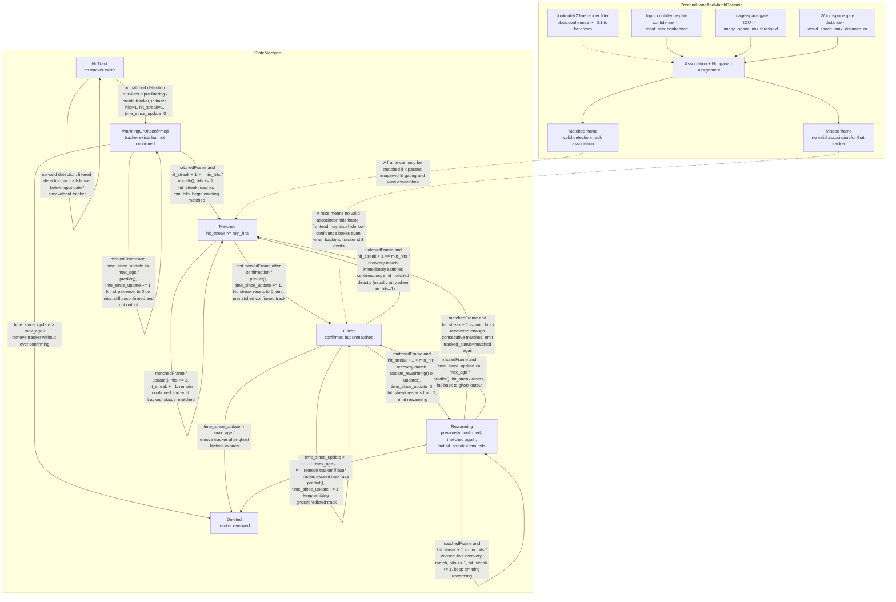

# Track State Machine Guide

This document is the single source of truth for how track status changes across the current `sort` backend and the `lookout-V2` frontend.

For the end-to-end runtime workflow of the world-space constant-velocity tracker, see `docs/WORLD_SPACE_CONSTANT_VELOCITY_TRACKER_GUIDE.md`.

It covers:

- the conceptual states: `no track`, `warming/unconfirmed`, `matched`, `ghost`, `rewarming`, `deleted`
- the actual counters and thresholds used in code
- the difference between tracker-internal state and frontend-visible status labels
- the extra `lookout-V2` confidence filtering that affects visualization but does not directly mutate backend tracker state

## Scope

This guide is based on the current code in:

- `sort_ws/image_space_tracker.py`
- `sort_ws/world_space_tracker.py`
- `sort_ws/bridge.py`
- `lookout-V2/src/main.js`
- `lookout-V2/src/playback_mode_timestamp.js`

## Important Terminology

The backend tracker does not store a literal enum like `state = "ghost"`.
Instead, the effective state is derived each frame from:

- `hits`: total number of matched detections the tracker has ever received
- `hit_streak`: number of consecutive matched frames since the last miss
- `time_since_update`: number of consecutive frames since the last match

Those counters are what actually drive transitions.

## High-Level Truth

- `warming/unconfirmed` means a brand new tracker exists but has never been confirmed yet.
- `matched` means the track matched a detection this frame and has enough consecutive matches.
- `ghost` means a previously confirmed track did not match this frame, but has not yet aged out.
- `rewarming` means a previously confirmed track matched again after one or more misses, but has not yet rebuilt enough consecutive matches to be fully matched again.
- `deleted` means the tracker object has been removed because it exceeded `max_age`.

## Mermaid State Diagram

## What Counts As A Match

The tracker first predicts all existing tracks, then tries to associate detections to predicted tracks.

A detection-track pair only counts as a valid match if it passes the mode-specific gate:

- image space: `IOU >= image_space_iou_threshold`
- world space: `distance <= world_space_max_distance_m`

After gating, Hungarian assignment picks the final detection-track pairs.

So a track state change always starts from one of two events:

- `matched frame`: a valid association was made
- `missed frame`: no valid association was made

## The Parameters That Actually Matter

### Core state-machine parameters in `sort`

- `min_hits`
  - consecutive matches required to become or return to `matched`
- `max_age`
  - maximum tolerated missed frames before deletion
- `input_min_confidence`
  - required confidence for a raw detection to enter either tracker at all
- `image_space_iou_threshold`
  - image-space association gate
- `world_space_max_distance_m`
  - world-space association gate
- `image_space_alpha_distance`, `image_space_beta_heading`, `image_space_gamma_confidence`
  - image-space assignment cost weights
- `world_space_beta_heading`, `world_space_gamma_confidence`
  - world-space assignment cost weights

### Frontend-side condition in `lookout-V2`

`lookout-V2/src/main.js` has a live render filter:

- if `bbox.confidence < 0.1`, the bbox is skipped in the frontend render loop

That affects whether a returned bbox is visualized in `lookout-V2`, but it does not directly mutate backend tracker counters.

This means:

- `sort` can still have a live internal track
- but `lookout-V2` may not render that bbox on a given frame if confidence is below `0.1`

### Playback caveat in `lookout-V2`

`lookout-V2/src/playback_mode_timestamp.js` synthesizes playback detections with `tracked_status: "matched"` and does not replay the full backend `ghost/rewarming` state machine.

So:

- live websocket data from `sort` is the true source of status transitions
- playback timestamp reconstruction is not a faithful state-machine replay

## Runtime Defaults Versus Constructor Defaults

If you want the defaults used by normal `sort-3d.py` launches, the CLI defaults in `sort_ws/bridge.py` matter more than the tracker class constructor defaults.

### Current CLI defaults in `sort_ws/bridge.py`

#### Image space

- `input_min_confidence = 0.0`
- `image_space_max_age = 40`
- `image_space_min_hits = 300`
- `image_space_iou_threshold = 0.1`
- `image_space_alpha_distance = 0.15`
- `image_space_beta_heading = 0.0`
- `image_space_gamma_confidence = 0.0`

#### World space

- `world_space_max_age = 50`
- `world_space_min_hits = 5`
- `world_space_max_distance_m = 50.0`
- `world_space_beta_heading = 0.0`
- `world_space_gamma_confidence = 0.0`

## State-By-State Explanation

### 1. `NoTrack`

Meaning:

- no tracker object exists for this target, or
- a tracker existed but was deleted, or
- a detection was present but did not create a tracker

How you stay in `NoTrack`:

- no detection exists for this target
- detection is filtered out before use
- detection does not pass `input_min_confidence`

How you leave `NoTrack`:

- an unmatched detection creates a new tracker

What "unmatched detection creates a new tracker" means:

- the association step could not match that detection to any existing tracker
- so it becomes an unmatched detection
- if it survives `input_min_confidence`, the tracker allocates a brand new internal track object for it when it remains unmatched

### 2. `WarmingOrUnconfirmed`

Meaning:

- the tracker has been born
- it has not yet been confirmed
- it has never yet earned the public `matched` state

Typical counter pattern:

- `hits < min_hits`
- `hit_streak < min_hits`

How it is entered:

- `NoTrack -> WarmingOrUnconfirmed` after one unmatched detection spawns a tracker

How it behaves:

- consecutive matches increase both `hits` and `hit_streak`
- a miss resets `hit_streak` to `0` on the next predict cycle
- it usually remains internal only and is not output as a visible stable track

How it exits:

- `WarmingOrUnconfirmed -> Matched` when `hit_streak >= min_hits`
- `WarmingOrUnconfirmed -> Deleted` when `time_since_update > max_age`

Important note:

- an unconfirmed track can miss frames and still remain an internal unconfirmed tracker until it either confirms or ages out
- it does not become `ghost` because ghosting is reserved for previously confirmed tracks

### 3. `Matched`

Meaning:

- the track matched a detection this frame
- and it currently has enough consecutive matches to be confirmed

Exact condition:

- `hit_streak >= min_hits`

How it is entered:

- `WarmingOrUnconfirmed -> Matched` once the new track accumulates enough consecutive hits
- `Rewarming -> Matched` once a previously confirmed track rebuilds enough consecutive hits after a dropout
- `Ghost -> Matched` directly only if the recovery match already satisfies `hit_streak >= min_hits`

In practice:

- after a miss, `hit_streak` is reset to `0`
- so a direct `Ghost -> Matched` jump is usually only practical when `min_hits == 1`

How it exits:

- `Matched -> Ghost` on the first missed frame after confirmation

### 4. `Ghost`

Meaning:

- the track was previously confirmed
- but it did not match a detection this frame
- it is still alive because `time_since_update <= max_age`

Exact condition:

- not matched this frame
- and the tracker had already been confirmed in the past

Counter intuition:

- `time_since_update > 0`
- `hit_streak` has been reset to `0`
- `hits` stays high because it is total lifetime matches

How it is entered:

- `Matched -> Ghost` after one miss
- `Rewarming -> Ghost` if the recovering track misses again before rebuilding `hit_streak`

How it exits:

- `Ghost -> Rewarming` on the first recovery match if the track was previously confirmed but still needs more consecutive hits
- `Ghost -> Matched` if the recovery match already satisfies confirmation
- `Ghost -> Deleted` if `time_since_update > max_age`

### 5. `Rewarming`

Meaning:

- the track was confirmed in the past
- then missed one or more frames
- then matched again
- but has not yet rebuilt enough consecutive matched frames to be `matched`

This is different from `warming` because it represents recovery of a known prior track, not birth of a new one.

Typical counter pattern:

- `hits > min_hits`
- `hit_streak < min_hits`

How it is entered:

- `Ghost -> Rewarming` on the first recovery match when:
  - the track was previously confirmed
  - and `(hit_streak + 1) < min_hits` before update

How it behaves:

- each consecutive recovery match increments `hit_streak`
- the track is considered to be rebuilding trust

How it exits:

- `Rewarming -> Matched` when `hit_streak >= min_hits`
- `Rewarming -> Ghost` if it misses again before rebuilding the streak
- `Rewarming -> Deleted` if it later remains unmatched long enough that `time_since_update > max_age`

### 6. `Deleted`

Meaning:

- the tracker object is removed from memory
- the stable identity is gone

Exact condition:

- `time_since_update > max_age`

Important nuance:

- deletion uses `>` not `>=`
- so a track survives exactly `max_age` missed frames
- it is deleted on the next missed frame

Once deleted:

- the next future detection starts from `NoTrack`
- a new tracker may be born, but it is a new lifecycle

## Transition Table

| From | To | Condition |
|------|----|-----------|
| `NoTrack` | `WarmingOrUnconfirmed` | detection is not matched to an existing track and passes `input_min_confidence` |
| `NoTrack` | `NoTrack` | no valid detection, detection filtered out, or confidence below input gate |
| `WarmingOrUnconfirmed` | `WarmingOrUnconfirmed` | another match occurs but `hit_streak < min_hits` |
| `WarmingOrUnconfirmed` | `Matched` | matched frame makes `hit_streak >= min_hits` |
| `WarmingOrUnconfirmed` | `Deleted` | `time_since_update > max_age` before ever confirming |
| `Matched` | `Matched` | another matched frame keeps `hit_streak >= min_hits` |
| `Matched` | `Ghost` | one missed frame after confirmation |
| `Ghost` | `Ghost` | more missed frames while `time_since_update <= max_age` |
| `Ghost` | `Rewarming` | first recovery match after a miss, but still `hit_streak < min_hits` |
| `Ghost` | `Matched` | recovery match already makes `hit_streak >= min_hits` |
| `Ghost` | `Deleted` | `time_since_update > max_age` |
| `Rewarming` | `Rewarming` | another consecutive recovery match but `hit_streak < min_hits` |
| `Rewarming` | `Matched` | recovery match makes `hit_streak >= min_hits` |
| `Rewarming` | `Ghost` | miss again before full recovery |
| `Rewarming` | `Deleted` | later misses push `time_since_update > max_age` |

## Warming Versus Rewarming

This is the most important distinction:

### `WarmingOrUnconfirmed`

- birth of a new track
- has never been confirmed
- usually not emitted as a public stable track
- becomes `matched` only after first accumulating `min_hits` consecutive matches

### `Rewarming`

- recovery of a previously confirmed track
- had a valid identity before the dropout
- is emitted as a special "unmatched but recovering" case in world-space output
- becomes `matched` only after rebuilding `min_hits` consecutive matches after the miss

They can both begin from one matched frame, but:

- `warming` begins from a birth event
- `rewarming` begins from a recovery event

## What The Frontend Actually Sees

### Live data from `sort`

In live mode, `sort_ws/bridge.py` maps backend outcomes into output labels:

#### World space

- matched detection -> `tracked_status = "matched"`
- unmatched confirmed track with no detection -> `tracked_status = "unmatched"`, `unmatched_status = "ghost"`
- recovery match before full reconfirmation -> `tracked_status = "unmatched"`, `unmatched_status = "rewarming"`

#### Image space

- matched detection -> `tracked_status = "matched"`
- unmatched confirmed track -> `tracked_status = "unmatched"`

Important note:

- image-space output does not explicitly split `ghost` and `rewarming`
- but the same underlying counters still conceptually create those situations

### `lookout-V2` live visualization

`lookout-V2` usually consumes the backend-emitted statuses.

However, before rendering, `lookout-V2/src/main.js` skips:

- any bbox with `confidence < 0.1`

So a valid backend track can still be absent from the frontend view on a particular frame if the frontend confidence filter rejects it.

### `lookout-V2` playback timestamp mode

`lookout-V2/src/playback_mode_timestamp.js` synthesizes playback detections with:

- `tracked_status = "matched"`

That means playback timestamp reconstruction is useful for stable ID playback, but it is not a full replay of the backend ghost/rewarming transitions.

## Practical Examples

### Example A: new object appears

Assume `min_hits = 5`.

- frame 1: detection is unmatched to any existing track and passes input confidence filtering -> `WarmingOrUnconfirmed`
- frame 2: matched again -> still `WarmingOrUnconfirmed`
- frame 3: matched again -> still `WarmingOrUnconfirmed`
- frame 4: matched again -> still `WarmingOrUnconfirmed`
- frame 5: matched again, now `hit_streak = 5` -> `Matched`

### Example B: confirmed object drops out and comes back

Assume `min_hits = 5`, `max_age = 50`.

- frame 100: track is `Matched`
- frame 101: no valid association -> `Ghost`
- frame 102: detection returns and matches -> `Rewarming`
- frame 103: matches again -> `Rewarming`
- frame 104: matches again -> `Rewarming`
- frame 105: matches again -> `Rewarming`
- frame 106: matches again, now `hit_streak = 5` -> `Matched`

### Example C: ghost ages out

Assume `max_age = 50`.

- first missed frame after confirmation -> `Ghost`
- after 50 missed frames total -> still alive
- on the next missed frame, where `time_since_update > 50` -> `Deleted`

## Final Takeaways

- `min_hits` controls both first confirmation and recovery confirmation.
- `max_age` controls how long a missed confirmed track can remain alive before deletion.
- `input_min_confidence` is the only confidence gate on tracker input; detections below it never reach image-space or world-space association.
- `world_space_max_distance_m` and `image_space_iou_threshold` determine whether a frame is treated as matched or missed at all.
- `warming` and `rewarming` are not the same:
  - warming = new birth, never confirmed
  - rewarming = previously confirmed, reacquiring after dropout
- `lookout-V2` has a live confidence render filter at `0.1`, but that is a frontend visualization rule, not the backend state machine itself.
- `lookout-V2` playback timestamp mode is not a faithful replay of backend ghost/rewarming states.
