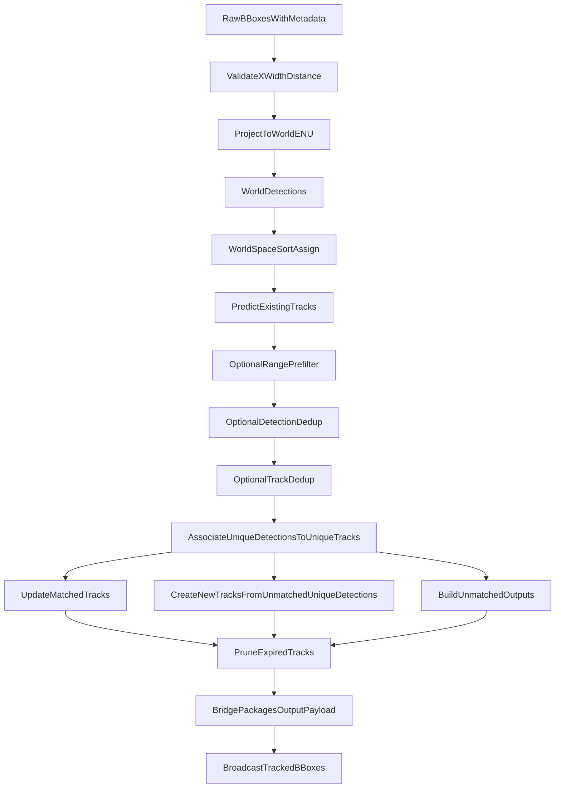
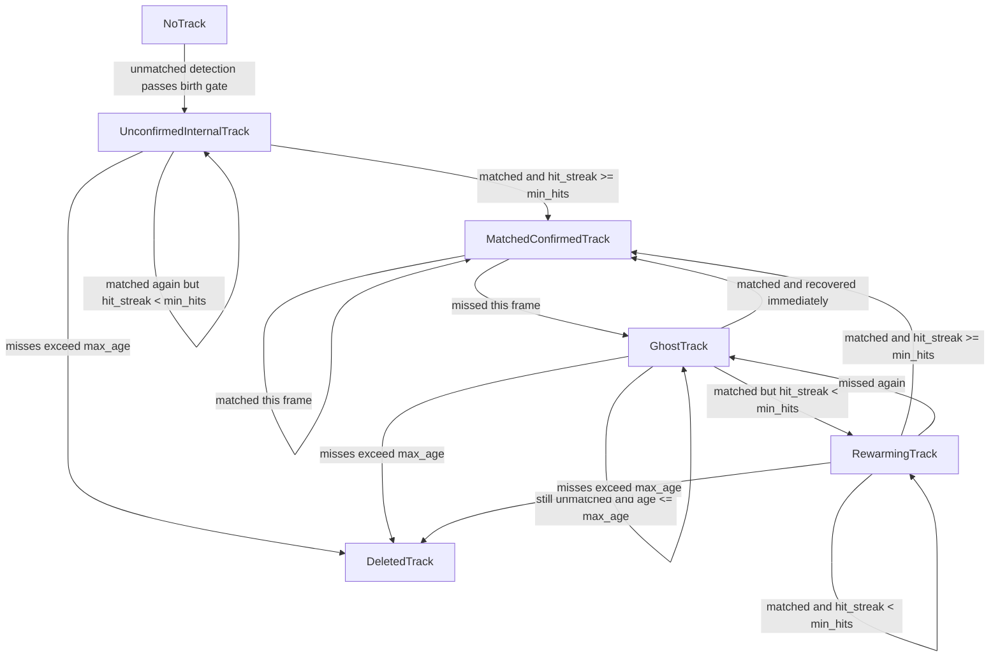
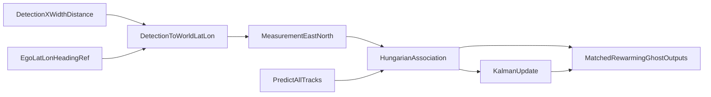

# World-Space Constant-Velocity Tracker Guide

This guide explains the end-to-end workflow of the world-space, constant-velocity tracker in this repository.

It is intentionally specific to the `world_space_kf_model=cv` path implemented in:

- `sort_ws/bridge.py`
- `sort_ws/image_to_world.py`
- `sort_ws/world_space_tracker.py`

This guide does not try to document the image-space tracker or the constant-acceleration world tracker in detail. Those exist in the codebase, but they are out of scope here unless they help explain the constant-velocity path by contrast.

## See Also

- `README.md` for the broader Kalman filter background and repo-level runtime context
- `docs/TRACKER_PARAMETERS_GUIDE.md` for tuning knobs and how they affect matched, rewarming, and ghost behavior
- `docs/TRACK_STATE_MACHINE_GUIDE.md` for the shared lifecycle terminology across backend and frontend

## What This Tracker Actually Does

At a high level, each frame goes through this sequence:

1. Start with raw detector bounding boxes and per-detection metadata.
2. Convert each usable detection into a world-space ENU point measurement.
3. Predict every existing internal track forward with a constant-velocity Kalman filter.
4. Optionally pre-filter predicted tracks and detections by ego-relative ENU range.
5. Optionally de-duplicate detections and predicted tracks before association.
6. Associate the surviving unique detections to the surviving unique predicted tracks in ENU meters.
7. Update matched tracks with the new measurement.
8. Spawn new tracks from unmatched unique detections that pass the birth gate.
9. Emit matched tracks, rewarming tracks, and ghost tracks for downstream consumers.
10. Delete stale tracks that have missed too many frames.

The important design choice is that the filter does not track image-space bounding boxes. It tracks a 2D point in local ENU meters.

## Frame Pipeline

## Core Files And Responsibilities

### `sort_ws/bridge.py`

This is the runtime entrypoint for world tracking inside the websocket bridge.

For the constant-velocity path, `_track_world_space()` is the key function:

- reads raw `bboxes`
- returns an empty result until ego latitude/longitude, heading, and local ENU reference are available
- skips detections that do not have usable `x`, `width` or `w`, and positive `distance`
- converts each surviving detection into world-space fields
- computes current ego ENU from the local reference
- calls `world_tracker.assign(world_dets, ego_enu_from_ref=...)`
- packages the matched and unmatched outputs back into the outgoing bbox payload

`_process_video_payload()` then decides whether `vm.metadata["bboxes"]` should carry image-space results or world-space results.

### `sort_ws/image_to_world.py`

This file converts a detection from image geometry plus ego pose into world-space ENU.

Important helpers:

- `pixel_x_to_bearing_rad()`
- `camera_relative_xy_m()`
- `right_fwd_to_enu_m()`
- `detection_to_world_latlon()`

### `sort_ws/world_space_tracker.py`

This is the actual world tracker implementation.

The main pieces are:

- `KalmanCVPointTracker` for the per-track constant-velocity filter
- `associate_world_detections_to_trackers()` for world-space association
- `WorldSpaceSort.assign()` for the full per-frame orchestration

## Step 1: Raw Detections Enter The Bridge

The world-space tracker starts from upstream detection dicts in `vm.metadata["bboxes"]`.

The bridge expects the detection stream to contain image-space geometry and range-related fields, typically including:

- `x`
- `y`
- `width` or `w`
- `height` or `h`
- `distance`
- optional `heading`
- optional `category`
- optional `confidence`

World-space tracking also requires a usable ego state. If the bridge does not yet have ego latitude/longitude, heading, and local reference data, `_track_world_space()` returns an empty list and the world tracker does not run for that frame.

For world projection, the bridge only keeps detections that can provide:

- a valid left-edge `x`
- a valid width
- a strictly positive `distance`

If a detection cannot satisfy those requirements, it is ignored by `_track_world_space()`.

That means the world tracker never sees every raw detection. It only sees the subset that can be projected into a valid world-space measurement.

## Step 2: Detection To World / ENU Conversion

The world tracker does not ingest image-space `x/y/w/h` directly as the Kalman measurement. The bridge first turns each detection into an ENU point.

### 2.1 Bottom-center x and range

For each detection, `_track_world_space()` computes:

- `x_bottom_center = x + width / 2`
- `distance_m = det["distance"]`

The tracker uses the horizontal image location and the detector-provided range to infer where the object sits relative to the camera and boat.

### 2.2 Pixel x to camera-relative bearing

`pixel_x_to_bearing_rad()` converts the pixel column to a horizontal bearing around the camera optical axis using the configured image width and horizontal FOV.

That bearing is then used by `camera_relative_xy_m()` to compute:

- `right_m`
- `forward_m`

These are camera- or boat-relative ground-plane coordinates.

### 2.3 Boat-relative to ENU

`right_fwd_to_enu_m()` rotates the relative `(right, forward)` coordinates using the ego heading convention:

- `0` degrees means north
- `90` degrees means east
- heading increases clockwise

The result is `enu_rel_ego`, the target position relative to ego in east/north meters.

### 2.4 Local reference frame

The world tracker does not work directly in latitude/longitude. Instead it uses local ENU meters relative to a fixed local reference point.

`detection_to_world_latlon()` combines:

- ego latitude/longitude
- ego heading
- image x position
- range
- camera yaw offset
- local ENU reference

and returns:

- `world_latlon`
- `enu_from_ref`
- `enu_rel_ego`

The bridge writes these fields onto the detection dict:

- `world_latitude`
- `world_longitude`
- `world_east_m`
- `world_north_m`
- `world_rel_ego_east_m`
- `world_rel_ego_north_m`

### Why ENU Instead Of Lat/Lon

The constant-velocity tracker runs in ENU because:

- the Kalman filter state is easier to model in linear meter units
- Euclidean distance gating is meaningful in meters
- covariance matrices and association costs are numerically better behaved in local Cartesian coordinates

In other words, ENU is the tracker's working coordinate system, while latitude/longitude is mostly for packaging and display.

## Step 3: World Detections Become Kalman Measurements

After projection, the bridge passes `world_dets` into `WorldSpaceSort.assign()`.

`assign()` now also receives the current ego ENU position relative to the same local reference so the tracker can:

- pre-filter detections by ego-relative range
- pre-filter predicted tracks by ego-relative range
- keep those range decisions aligned to the current predicted frame instead of the previous frame

Inside the world tracker, `_det_to_xy()` extracts the measurement and tracker metadata from each detection:

- measurement position: `world_east_m`, `world_north_m`
- extras: `confidence`, `category`, `heading_deg`
- relative ego ENU: `world_rel_ego_east_m`, `world_rel_ego_north_m`
- last bbox geometry for back-projection: `y`, `width`, `height`

For the constant-velocity tracker, the measurement vector is always:

- `z = [east, north]`

The measurement is a point in world space, not a bounding box.

Before Hungarian association, the tracker can now run two optional cleanup stages on the current frame:

- range pre-filtering
  - detections and predicted tracks are filtered independently against `prefilter_max_range_m`
  - both comparisons use the same current-frame ego ENU reference
- de-duplication
  - detections are clustered by ENU distance similarity
  - predicted tracks are clustered by a weighted combination of position, direction, and speed-difference similarity
  - only the first processed member of each cluster survives into Hungarian association
  - duplicate tracks are suppressed from association and downstream output, but remain internal so they can age out naturally

## Step 4: Constant-Velocity Kalman Filter Internals

Each internal track is a `KalmanCVPointTracker`.

### State And Measurement

The constant-velocity state is:

- `[east, north, ve, vn]`

where:

- `east`, `north` are position in local ENU meters
- `ve`, `vn` are velocity in meters per second

The measurement is:

- `[east, north]`

So the tracker observes position only. Velocity is inferred over time by the filter.

### Predict Model

The state transition is rebuilt every predict step using the real elapsed `dt`:

- `east' = east + ve * dt`
- `north' = north + vn * dt`
- `ve' = ve`
- `vn' = vn`

`KalmanCVPointTracker._rebuild_dynamics(dt)` rebuilds both:

- `F`, the constant-velocity transition matrix
- `Q`, the process noise matrix using a continuous white-noise acceleration model

This matters because the tracker is not assuming a fixed frame rate. It uses actual elapsed time between `assign()` calls, with:

- `_DEFAULT_DT_S = 1/30` on first use
- `_MAX_DT_S = 2.0` as a safety clamp for long pauses, seeks, or reconnects

### Measurement Model

The observation model `H` only reads out position from the state:

- measure east
- measure north

There is no direct velocity measurement in the constant-velocity path.

### Measurement Covariance `R`

The world tracker does not use a single fixed isotropic measurement covariance.

Instead, `_measurement_covariance_from_rel_enu()` builds `R` from:

- relative ego-to-target direction
- `measurement_noise_cross_var_m2`
- `measurement_noise_radial_scale`

Conceptually:

- cross-range variance is the baseline
- radial variance is scaled from that baseline
- the covariance ellipse is rotated into ENU using the current line-of-sight direction

This is important because range noise and bearing-derived cross-range noise often behave differently.

### State Clamping

After both `predict()` and `update()`, the tracker clamps velocity magnitude using category-specific speed caps:

- `max_speed_boat_mps`
- `max_speed_other_mps`

The clamping preserves direction and limits unrealistic motion, especially during occlusions or noisy measurements.

## Step 5: Predict Existing Tracks

At the start of `WorldSpaceSort.assign()`, the tracker computes `dt` from wall-clock time since the previous call and predicts every existing track forward.

For each tracker:

1. rebuild `F` and `Q` using the current `dt`
2. call `kf.predict()`
3. clamp the state
4. increment age and miss counters
5. reset `hit_streak` to `0` if the track had already been unmatched before this frame

The predicted position is what gets used for association in the current frame.

If prediction produces invalid values like `NaN`, that tracker is dropped before association continues.

## Step 6: Associate Detections To Predicted Tracks

Association is handled by `associate_world_detections_to_trackers()`.

### 6.1 Distance Matrix

The tracker first computes an ENU Euclidean distance matrix between:

- current world detections
- predicted track positions

This is done by `_euclid_dist_matrix()`.

### 6.2 Optional Cost Terms

The base cost is distance, but the tracker can add:

- heading penalty via `beta_heading`
- confidence penalty via `gamma_confidence * (1 - confidence)`

So the effective assignment cost is:

- `distance + heading_term + confidence_term`

Distance is still the main term. The others are optional modifiers.

### 6.3 Gating

Before a pair is allowed to match, it must pass:

- `distance <= max_distance_m`

If nothing passes the gate, then:

- every detection is unmatched
- every existing track is unmatched

### 6.4 Hungarian Assignment

For the pairs that survive gating, the tracker runs Hungarian assignment through `linear_assignment()`.

That wrapper uses:

- `lap` if available
- otherwise SciPy's `linear_sum_assignment`

The output is:

- `matches`
- `unmatched_dets`
- `unmatched_trk_indices`

## Step 7: Update Matched Tracks

For each matched detection-track pair, `WorldSpaceSort.assign()` updates the corresponding `KalmanCVPointTracker`.

There are two branches:

- `update()`
- `update_rewarming()`

The branch depends on whether the track was already confirmed and whether the current match is enough to restore it fully.

### Normal matched update

The common path is `update()`:

1. reset `time_since_update`
2. increment `hits`
3. increment `hit_streak`
4. rebuild `R` from the current relative ego geometry
5. run `kf.update(z)`
6. clamp the state
7. store latest extras

If the track now has `hit_streak >= min_hits`, it becomes a public matched output for this frame.

### Rewarming update

If a track was previously confirmed but has not yet rebuilt enough consecutive matches after a miss, the tracker uses `update_rewarming()`.

This is an important implementation detail:

- the docstring says it marks a rewarming track as seen without correcting the KF state
- the actual code still calls `kf.update(z)`

For documentation purposes, the code behavior is the source of truth: rewarming still performs a Kalman update in the current implementation.

## Step 8: Create New Tracks From Unmatched Detections

Every unmatched detection that already survived bridge-level `input_min_confidence` filtering is a candidate birth.

The tracker then allocates a new `KalmanCVPointTracker` with:

- the current ENU position as initial state position
- zero initial velocity
- large initial uncertainty on velocity

A newly created track starts with:

- `hits = 1`
- `hit_streak = 1`
- `time_since_update = 0`

New tracks do not immediately become public matched outputs unless `min_hits` is low enough to allow that.

## Step 9: Handle Unmatched Confirmed Tracks

If an existing track does not match a detection this frame, the tracker may still emit it as an unmatched output if it was already confirmed.

There are two practically important cases.

### Ghost tracks

If a confirmed track is unmatched this frame, `assign()` emits a ghost-like unmatched entry built from the predicted state:

- `track_id`
- `world_east_m`
- `world_north_m`
- `confidence`
- `heading`
- `category`
- last bbox geometry for back-projection
- velocity, speed, course, and covariance summaries
- `unmatched_frames`
- `tracker_max_age`

These are predict-only outputs for tracks that remain alive without a fresh detection.

### Rewarming tracks

If a previously confirmed track matches again but still has `hit_streak < min_hits`, the tracker emits a special unmatched-style rewarming entry.

That output:

- keeps the detection fields such as bbox geometry and metadata
- uses the predicted world position from before the update for `world_east_m` and `world_north_m`
- includes full Kalman kinematic fields
- adds an internal `_is_rewarming` marker for bridge packaging

This lets downstream code distinguish a recovering track from a plain ghost.

## Track Lifecycle Summary

## Step 10: Prune Dead Tracks

At the end of `assign()`, any tracker with:

- `time_since_update > max_age`

is removed from `self.trackers`.

This is what turns a live but unmatched internal track into a deleted one.

The same pruning logic also runs in the no-detections path.

## Step 11: Package Outputs Back Into Downstream BBoxes

After `WorldSpaceSort.assign()` returns, `_track_world_space()` converts tracker results into outgoing bbox dicts.

The returned tuple is:

- `assigned_ids`
- `unmatched_tracks`
- `matched_track_states`

### Matched outputs

For each detection whose assigned ID is not `None`, the bridge emits a matched world-space bbox with:

- `track_id`
- `tracked_space = "world_space"`
- `tracked_status = "matched"`
- `enu_ref_lat`
- `enu_ref_lon`

If `matched_track_states` contains the full KF state, the bridge overwrites the detection's world position with the filtered state:

- `world_east_m`
- `world_north_m`
- `world_latitude`
- `world_longitude`
- `world_rel_ego_east_m`
- `world_rel_ego_north_m`

It also attaches:

- `vel_east_mps`
- `vel_north_mps`
- `speed_mps`
- `course_deg`
- `accel_east_mps2`
- `accel_north_mps2`
- `state_position_covariance_enu`
- `process_position_covariance_enu`
- `measurement_position_covariance_enu`

For the constant-velocity tracker, the acceleration fields are present but `None`.

### Rewarming outputs

If `unmatched_tracks` contains an entry marked with `_is_rewarming`, the bridge emits:

- `tracked_space = "world_space"`
- `tracked_status = "unmatched"`
- `unmatched_status = "rewarming"`

and preserves the detection-side geometry instead of back-projecting from world space.

### Ghost outputs

For ordinary unmatched confirmed tracks, the bridge emits:

- `tracked_space = "world_space"`
- `tracked_status = "unmatched"`
- `unmatched_status = "ghost"`

Because ghosts do not come from a current detection, the bridge uses `world_to_image_space()` to back-project the predicted world position into image-space `x` and `distance`, while reusing the track's stored last-known bbox height and width if available.

### Where the packaged results go next

After `_track_world_space()` returns:

- `_process_video_payload()` may select `tracked_world` as the outgoing `vm.metadata["bboxes"]` payload, depending on tracking mode
- if path planning is enabled and ego state is available, the same `tracked_world` list is also passed into `PathPlannerRuntime.compute()`
- the bridge then encodes the payload and broadcasts it to downstream websocket clients

For the detailed downstream path-planning flow after `PathPlannerRuntime.compute()` is called, see `docs/ASTAR_EGO_RELATIVE_PATH_PLANNER_GUIDE.md`.

## Public Output Types Versus Internal Tracks

One subtle but important detail is that not every internal tracker is visible downstream.

### Internal only

Tracks stay internal when they have not yet reached confirmation:

- `assigned_ids` remains `None`
- they do not appear as matched outputs
- they do not appear as ghost outputs

### Public matched tracks

Tracks become public matched outputs when:

- they matched a detection this frame
- `hit_streak >= min_hits`

### Public rewarming tracks

Tracks can appear as rewarming outputs when:

- they were previously confirmed
- they matched again after a gap
- they still have not rebuilt enough consecutive matches to return to matched

### Public ghost tracks

Tracks can appear as ghost outputs when:

- they were previously confirmed
- they did not match a detection this frame
- they have not yet aged out

## End-To-End Data Flow Example

## Relationship To Other Docs

Use this guide when you want the code-path walkthrough.

Use the other docs when you need adjacent answers:

- `README.md`: broader explanation of Kalman filter math, runtime setup, and world-space mode overview
- `docs/TRACKER_PARAMETERS_GUIDE.md`: parameter-by-parameter tuning advice for `max_age`, `min_hits`, `max_distance_m`, `q_intensity`, measurement noise, and speed caps
- `docs/TRACK_STATE_MACHINE_GUIDE.md`: unified state terminology and lifecycle naming shared across backend output and frontend interpretation

## Practical Summary

If you only remember one version of the workflow, remember this:

1. The bridge projects usable detections from image geometry plus range into local ENU.
2. The constant-velocity tracker predicts all tracks forward in ENU meters.
3. Association matches detections to predictions using distance-gated Hungarian assignment.
4. Matched tracks run a Kalman update, unmatched detections may create new tracks, and unmatched confirmed tracks become ghost outputs.
5. The bridge packages those results back into outgoing bbox dicts with matched, rewarming, or ghost status labels.

That is the core workflow of the world-space constant-velocity tracker in this repository.
